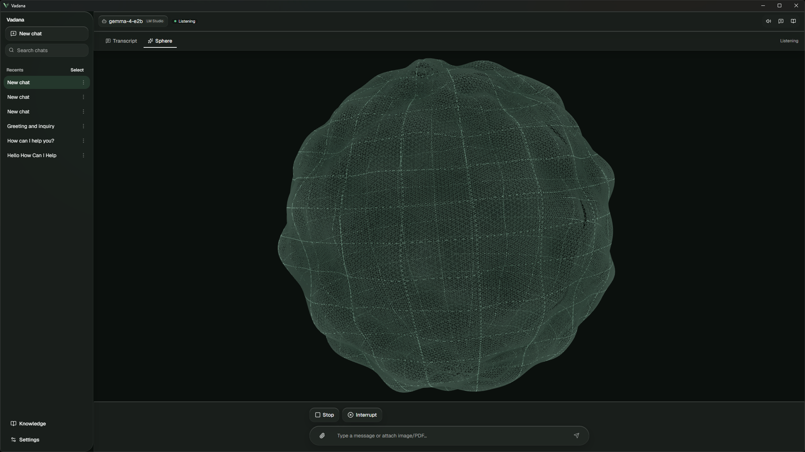
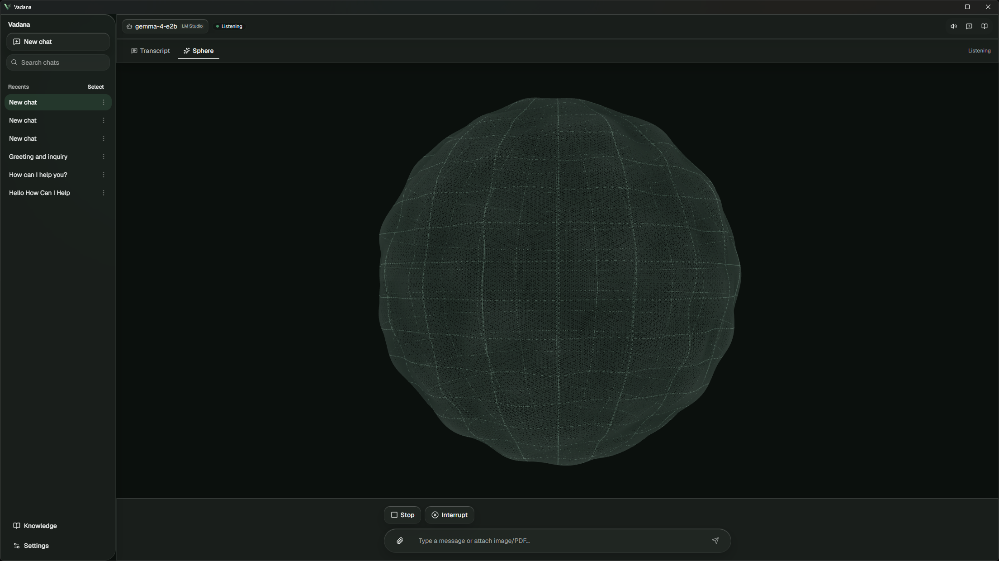
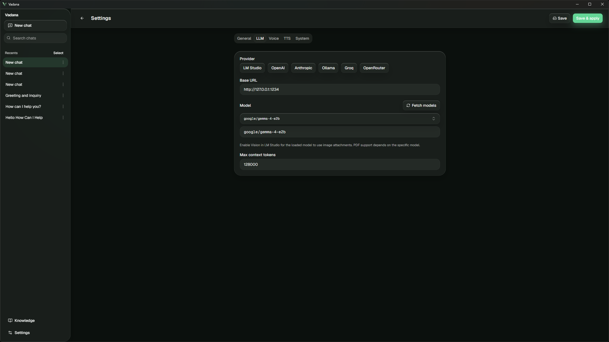
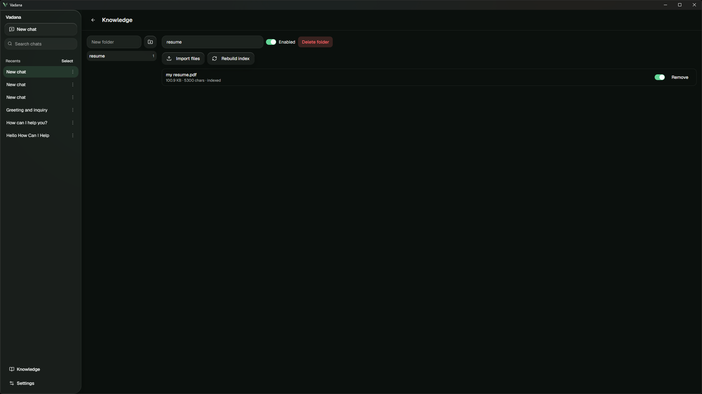
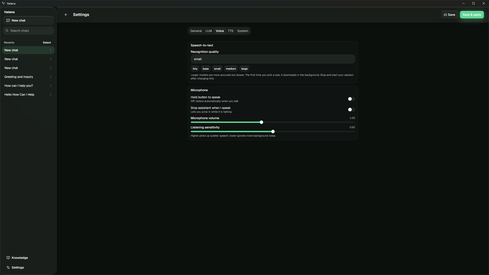

<p align="center">
  
</p>

# Vadana

> **Stable release** — `0.2.3`. Installers and auto-update feed are published via [GitHub Releases](https://github.com/Lohit-Behera/vadana/releases) and [docs/build.md](docs/build.md). Report issues on GitHub.

**Vadana** (Sanskrit: *vadana* — speech) is an open-source, local desktop voice assistant. Tauri + React talk to a **Python sidecar** over WebSocket. Speech is captured, segmented with **Silero VAD**, transcribed with **local OpenAI Whisper** (`openai-whisper` / PyTorch, default `small`), sent to an LLM via **LiteLLM** (default **LM Studio**; also OpenAI, Anthropic, Ollama, Groq), then spoken with **Supertonic**, **Piper** (if configured), or **pyttsx3** / SAPI on Windows.

**Chat history** is stored in **Tauri SQLite** (sidebar). **Conversation context** is kept in the backend for the active session and shown as token usage in the header. Cloud API keys are stored in the **OS keychain**, not on disk.

## Screenshots

| Home & sessions | Voice & chat | Sphere visualizer |
| --- | --- | --- |
|  |  |  |

| LLM settings | Knowledge base | Voice settings |
| --- | --- | --- |
|  |  |  |

## Documentation

| Area | Guide |
|------|--------|
| **Release builds** (Windows, macOS, Linux) | [docs/build.md](docs/build.md) |
| **Frontend** (React, Vite, Tauri UI) | [docs/frontend.md](docs/frontend.md) |
| **Backend** (Python WebSocket sidecar) | [backend/README.md](backend/README.md) |
| **WebSocket protocol** | [backend/protocol.md](backend/protocol.md) |

## App Showcase (GitHub Pages)

A separate one-page React showcase app for **Vadana** lives in `app-showcase`.

- Edit content in `app-showcase/src/App.jsx` (title, tagline, links).
- Screenshots and logo live in `app-showcase/public/` (`Vadana.svg`, `vadana_*.png`).
- Update styles in `app-showcase/src/index.css` (Tailwind) and layout in `app-showcase/src/App.jsx`.
- Local preview:

```powershell
cd app-showcase
npm install
npm run dev
```

- Automatic deploy: `.github/workflows/deploy-app-showcase.yml` deploys to GitHub Pages on push to `main` when files under `app-showcase/` change.

## Prerequisites

- **Rust** (Tauri 2), **Node** (pnpm), **uv** for Python.
- **LM Studio** (or Ollama with an OpenAI-compatible route) listening on `http://127.0.0.1:1234` with a model loaded.
- **uv** on `PATH` so Tauri can run `uv run python main.py` in `backend/`.
- **Headphones** recommended to avoid mic picking up speaker output.

## Quick start

**Backend** (optional if you only use the desktop app—it starts the sidecar for you):

```powershell
cd backend
uv sync
uv run python main.py
```

## CPU vs CUDA (Whisper + TTS runtime)

By default, Vadana runs on **CPU** (it works on any machine).

If you have an **NVIDIA GPU** and want **Whisper** on GPU (faster speech recognition), follow the **CUDA** steps in `backend/README.md` (same quick start, but with CUDA PyTorch + optional `onnxruntime-gpu`).

Default WebSocket: `ws://127.0.0.1:8765` (`LIVE_VOICE_PORT` to override).

**Desktop app:**

```powershell
pnpm install
pnpm tauri dev
```

Use the sidebar for **New chat** / past sessions. Open **Settings** for provider, model, TTS, and VAD. **Start** a voice session, speak or type; context usage appears in the header. Details: [docs/frontend.md](docs/frontend.md) and [backend/README.md](backend/README.md).

## LM Studio

1. Load a chat model in LM Studio.
2. Start the local server (default port **1234**).
3. In the app, set **Model id** to the same identifier LM Studio shows for the API (often under Server settings).

## TTS

- **Supertonic 3:** set a **Supertonic voice** (e.g. `M1`) and **lang** (e.g. `hi` for Hindi). Default model id **`supertonic-3`**. The backend uses PyPI **`supertonic`** with **`uv`** `dependency-metadata` so it installs alongside **NumPy 2**; **`hf-xet`** is included so Hugging Face **Xet** model downloads succeed. Use **Download model weights** in the app (or `uv run python -m live_voice.download_supertonic` in `backend/`) to prefetch before your first session. First run downloads weights from Hugging Face.
- **Default without voice / Piper:** `pyttsx3` (Windows SAPI) — no extra install; quality is basic.
- **Optional:** Install [Piper](https://github.com/rhasspy/piper) and download a voice `.onnx` + `.onnx.json`; put the full path to the `.onnx` file in **Piper model path** in the UI.

## Troubleshooting (Windows)

- If **Start session** fails, confirm `uv` works in a terminal: `uv --version`.
- If the WebSocket never connects, check firewall and that port `8765` is free.
- If there is no microphone input, allow microphone access for the app / Python.
- First run downloads **Silero VAD** and **Whisper** weights (one-time).

## Release build

See **[docs/build.md](docs/build.md)** for Windows, macOS, and Linux (prerequisites, `sync-backend`, artifacts, first-run `uv sync`, CUDA, troubleshooting).

**Security:** the voice WebSocket listens on `127.0.0.1` only. Do not expose port `8765` to the network.

## Development checks

```powershell
cd backend
uv sync --all-groups
uv run pytest
uv run ruff check live_voice tests
cd ..
pnpm install
pnpm test:run
pnpm build
cd src-tauri
cargo check
```

Smoke test (LM Studio optional with `-SkipLm`):

```powershell
.\scripts\smoke.ps1 -SkipLm
```

Full guides: [docs/frontend.md](docs/frontend.md) · [backend/README.md](backend/README.md) · [backend/protocol.md](backend/protocol.md).

## License

[Vadana](LICENSE) is open source under the **MIT License**. See [LICENSE](LICENSE) for the full text.
