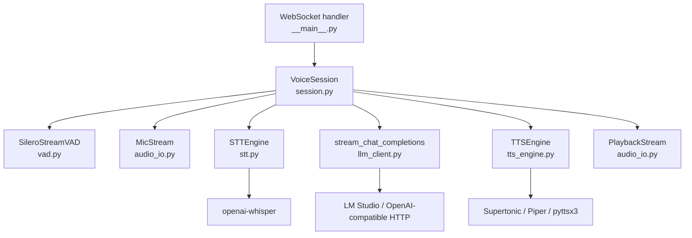

# Backend documentation

**live-voice-backend** is the Python **WebSocket sidecar** for [Vadana](../README.md). It captures microphone audio, segments speech with **Silero VAD**, transcribes with **local OpenAI Whisper** (`openai-whisper` / PyTorch), streams replies from an **OpenAI-compatible** chat API (e.g. LM Studio), and plays responses with **Supertonic**, **Piper**, or **pyttsx3** (Windows SAPI).

The Tauri app starts this process with `uv run python main.py` and talks to it over **`ws://127.0.0.1:8765`** (configurable). Audio is processed and played **on the machine running Python**, not in the browser.

## Requirements

- **Python 3.11 or 3.12** (`requires-python = ">=3.11,<3.13"`)
- **[uv](https://docs.astral.sh/uv/)** for dependencies and running the app
- **LM Studio** (or any OpenAI-compatible server) for the LLM
- **Windows** is the primary target (pyttsx3 + SAPI, COM for TTS); other platforms may work with Piper/Supertonic only
- **Microphone** and **speakers/headphones** (headphones strongly recommended to reduce echo)

## Quick start

From the repository root:

```powershell
cd backend
uv sync
uv run python main.py
```

You should see:

```text
LIVE_VOICE_READY port=8765
```

The desktop app connects automatically when you click **Start session**. To run the sidecar alone for debugging, keep this process running and point a WebSocket client at `ws://127.0.0.1:8765`.

## Environment variables

| Variable | Default | Description |
|----------|---------|-------------|
| `LIVE_VOICE_PORT` | `8765` | WebSocket listen port (binds **127.0.0.1** only) |
| `LIVE_VOICE_LOG` | `%LOCALAPPDATA%\vadana\logs\session.log` on Windows | Optional log file path; empty disables file logging |
| `HF_HUB_DISABLE_XET` | `1` (set in code) | Use standard HTTP for Hugging Face downloads |
| `LOCALAPPDATA` | — | Used to pick default log directory on Windows |

## Architecture



### Request path (one voice turn)

1. Client sends `config` (optional updates) and `start`.
2. **VAD** or **push-to-talk** collects utterance audio.
3. **STT** (`whisper_model`) → text → `stt_final` to client.
4. **LLM** streams tokens → `llm_token`; full reply → `assistant_text`.
5. **text_split** breaks reply into speakable chunks (sentence boundaries; decimals like `3.5` are not split on the inner `.`).
6. **TTS** synthesizes each chunk; **playback** plays locally with optional `playback_gain`.

Typed input uses `user_text` and skips STT but shares the same LLM + TTS pipeline.

## Package layout

```
backend/
├── main.py                 # Entry: re-exports live_voice.__main__
├── pyproject.toml          # Dependencies, pytest, ruff, uv metadata
├── uv.lock                 # Locked versions (commit this file)
├── protocol.md             # WebSocket JSON contract (authoritative)
├── live_voice/
│   ├── __main__.py         # WebSocket server, logging setup
│   ├── session.py          # VoiceSession: pipeline orchestration
│   ├── protocol.py         # Message types, server_event helper
│   ├── errors.py           # Stable error codes for the UI
│   ├── llm_client.py       # SSE streaming chat completions
│   ├── stt.py              # Whisper load + transcribe
│   ├── vad.py              # Silero VAD stream
│   ├── tts_engine.py       # Supertonic → Piper → pyttsx3 chain
│   ├── audio_io.py         # Mic capture + speaker playback
│   ├── text_split.py       # Sentence chunking for streaming TTS
│   └── download_supertonic.py  # HF weight prefetch CLI
└── tests/                  # pytest suite
```

## WebSocket protocol

Full message tables: **[protocol.md](protocol.md)**.

Summary:

- **Transport:** JSON text frames over WebSocket.
- **Handshake:** Server sends `{"type":"ready","port":8765,"protocol_version":1}` on connect.
- **Client:** `config`, `start`, `stop`, `interrupt`, `ptt_down`, `ptt_up`, `user_text`.
- **Server:** `state`, `stt_final`, `llm_token`, `assistant_text`, `error`, `notice`, `interrupt_ack`.
- **Max client message size:** 64 KiB UTF-8 (oversize → `error`).

### Error codes (`errors.py`)

| `code` | Typical cause |
|--------|----------------|
| `lm_unreachable` | LLM HTTP connection failed |
| `stt_failed` | Whisper / transcription error |
| `tts_failed` | Synthesis or playback failure |
| `mic_unavailable` | No capture device |
| `pipeline_failed` | Startup or internal pipeline error |
| `unknown` | Other |

## Configuration (`config` message)

Fields match [protocol.md](protocol.md). Defaults live in `VoiceSession.config` (`session.py`).

| Field | Default | Notes |
|-------|---------|--------|
| `lm_base_url` | `http://127.0.0.1:1234` | Trailing slash stripped for API calls |
| `model` | `local-model` | Must match loaded model on the server |
| `whisper_model` | `small` | `tiny`, `base`, `small`, `medium`, `large`, … |
| `push_to_talk` | `false` | If true, use `ptt_down` / `ptt_up` instead of VAD |
| `input_gain` | `1.0` | Mic amplitude scale |
| `vad_sensitivity` | `0.5` | Mapped to Silero threshold |
| `vad_barge_in` | `false` | Allow mic to interrupt assistant (echo-prone) |
| `system_prompt` | (built-in) | Chat system message |
| `piper_model` | `""` | Path to Piper `.onnx`; empty skips Piper |
| `supertonic_voice` | `""` | e.g. `M1`; empty → Piper or pyttsx3 |
| `supertonic_lang` | `en` | ISO language code |
| `supertonic_model` | `supertonic-3` | Hugging Face model id |
| `playback_gain` | `1.5` | TTS amplitude before playback (session-internal) |

**Apply settings** from the UI sends a new `config` while running; changing Whisper model or heavy TTS options may still require `stop` / `start`.

## Speech-to-text (Whisper)

- Package: **`openai-whisper`** (local PyTorch), not the OpenAI cloud API.
- First run downloads the checkpoint for `whisper_model`.
- Device: CUDA if available, else CPU (`stt.py`).

## Text-to-speech priority

1. **Supertonic 3** — if `supertonic_voice` is non-empty (`supertonic` on PyPI).
2. **Piper** — if `piper_model` points to a valid `.onnx` and Piper CLI is installed.
3. **pyttsx3** — Windows SAPI fallback (basic quality).

### Supertonic notes

- First run downloads weights from Hugging Face (~hundreds of MB).
- **Prefetch:**

  ```powershell
  uv run python -m live_voice.download_supertonic --check --model supertonic-3
  uv run python -m live_voice.download_supertonic --download --model supertonic-3
  ```

- The desktop app can trigger the same via Tauri (`download_supertonic_model`).
- **NumPy 2:** upstream `supertonic` may declare `numpy<2`; this repo uses `[tool.uv] dependency-metadata` in `pyproject.toml` so `uv sync` installs a compatible stack with PyTorch and Whisper.

### Streaming TTS

`text_split.flush_tts_chunks()` splits the LLM stream on `.?!;:\n` and max length. Periods between digits (e.g. version **3.5**) are **not** treated as sentence ends.

## LLM streaming

`llm_client.stream_chat_completions()` POSTs to `{lm_base_url}/v1/chat/completions` with `stream: true`, parses SSE `data:` lines, and yields text deltas. Supports both `delta.content` and `delta.message.content` shapes.

## Logging

At **INFO**, logs include:

- Silero VAD load
- Whisper model and device
- LM base URL and model id
- Active TTS backend
- Default playback device
- Per-chunk playback peaks / gain
- Per-turn timings (STT, LLM URL, reply length)

Format: `LEVEL logger: message` (`__main__.py` `basicConfig`).

## Development

### Install with dev tools

```powershell
cd backend
uv sync --all-groups
```

### Tests

```powershell
uv run pytest
uv run pytest -v tests/test_llm_stream.py   # single file
```

| Test module | Focus |
|-------------|--------|
| `test_protocol.py` | `ready` / error event shape |
| `test_errors.py` | Error codes |
| `test_sentence_split.py` / `test_text_split.py` | TTS chunking, decimals |
| `test_llm_stream.py` | SSE parsing, cancel, malformed JSON |

### Lint

```powershell
uv run ruff check live_voice tests
uv run ruff format live_voice tests   # optional format
```

### Run as installed CLI

```powershell
uv run live-voice
```

Equivalent to `uv run python main.py`.

## Bundling with Tauri

Release builds copy this folder into `src-tauri/resources/backend/`:

```powershell
# from repo root
pnpm run sync-backend
```

In **debug**, Tauri uses `../backend` directly. In **release**, it uses bundled `resources/backend/`. After packaging, end users still need `uv sync` in that folder unless you ship a pre-built `.venv`.

## Troubleshooting

### No assistant audio

1. **Wrong output device** — check log line `Playback | device …`; set Windows default playback device.
2. **Quiet TTS** — raise `playback_gain` in `config` (default `1.5`).
3. **Backend exited early** — check stderr from Tauri or `LIVE_VOICE_LOG`.
4. **React StrictMode (historical)** — UI no longer stops the sidecar on hook cleanup; restart session if unsure.

### NumPy / PyTorch import errors

Mixed NumPy versions in `.venv`:

1. Quit all Python processes.
2. Delete `backend/.venv`.
3. Run `uv sync` again (do not `pip install numpy` manually on top).

### Supertonic download fails

- Ensure network access to Hugging Face.
- `HF_HUB_DISABLE_XET=1` is set by default to avoid broken optional Xet wheels.

### WebSocket will not connect

- Port in use: change `LIVE_VOICE_PORT` or free **8765**.
- Firewall: server binds **127.0.0.1** only (not LAN-exposed by default).

## Security

- The WebSocket server listens on **127.0.0.1** only.
- Do not expose port **8765** to the network; there is no authentication on the socket.

## See also

- [WebSocket protocol](protocol.md)
- [Frontend documentation](../docs/frontend.md)
- [Project README](../README.md)
