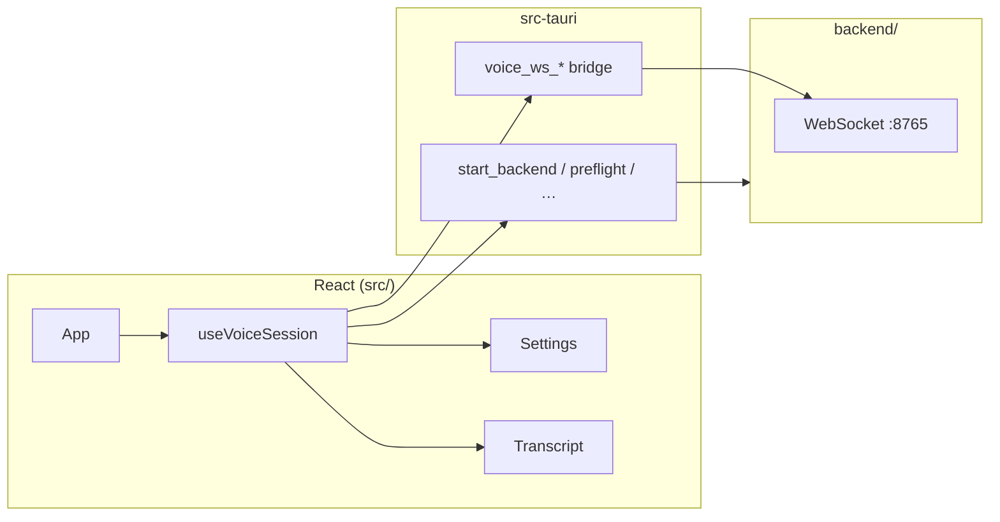

# Frontend documentation

The **Vadana** UI is a **React 19** + **TypeScript** single-page app built with **Vite 7** and **Tailwind CSS 4**. It ships inside a **Tauri 2** desktop shell. The frontend does not run speech models itself; it configures settings, drives the Python sidecar via Tauri, and displays transcript and session state.

## Stack

| Layer | Technology |
|-------|------------|
| UI | React 19, Radix UI primitives, shadcn-style components under `src/components/ui/` |
| Styling | Tailwind CSS 4 (`@tailwindcss/vite`), `cn()` helper (`clsx` + `tailwind-merge`) |
| Build | Vite 7, `@vitejs/plugin-react` |
| Desktop | Tauri 2 (`@tauri-apps/api`, shell + store plugins) |
| Tests | Vitest 4, jsdom, `@testing-library/jest-dom` |

## Directory layout

```
src/
├── main.tsx              # React root mount
├── App.tsx               # Shell: sidebar + main chat / full-page settings
├── App.css               # Global / app-level styles
├── assets/               # Static assets (e.g. logos)
├── components/
│   ├── layout/           # AppShell, AppSidebar, MainChat, ChatHeader
│   ├── chat/             # TranscriptThread
│   ├── settings/         # SettingsPage (tabs)
│   ├── SettingsPanel.tsx # Voice / TTS / system fields
│   └── ui/               # Reusable UI primitives (sidebar, tabs, progress, …)
├── hooks/
│   ├── useVoiceSession.ts  # Session lifecycle, WebSocket/bridge, context usage
│   └── useChats.ts         # SQLite chat list + persistence
└── lib/
    ├── tauri.ts          # `invoke` / `listen` wrappers (desktop-only guard)
    ├── chatsDb.ts        # Tauri SQL: chats + messages
    ├── keychain.ts       # API key get/set via Rust keyring commands
    ├── voiceBridge.ts    # Rust WebSocket proxy (preferred in Tauri)
    ├── voiceConfig.ts    # UI settings → backend `config` JSON
    ├── settings.ts       # Persisted voice settings (store + localStorage)
    ├── errorMessages.ts  # User-facing error strings from backend codes
    ├── supertonic.ts     # Supertonic model check / download via Tauri
    └── utils.ts          # `cn()` class name helper
```

Related (not under `src/`):

| Path | Role |
|------|------|
| `index.html` | Vite entry HTML |
| `vite.config.ts` | Dev server port **1420**, `@/` alias, Tauri watch ignores |
| `vitest.config.ts` | Unit test config (same `@/` alias) |
| `src-tauri/` | Rust shell: spawns Python, proxies WebSocket |
| `components.json` | shadcn/ui generator config |

## Running the frontend

### Desktop (recommended)

```powershell
pnpm install
pnpm tauri dev
```

Tauri runs `pnpm dev` (Vite on port **1420**) and loads the WebView. **Do not** use the browser tab alone for voice features—`invoke` and the voice bridge require the desktop app.

### Vite only (UI development)

```powershell
pnpm dev
```

Opens `http://localhost:1420` with limited functionality: settings use **localStorage** only, and Tauri commands throw with a message to run `pnpm tauri dev`.

### Production build

```powershell
pnpm build          # tsc + vite build → dist/
pnpm tauri build    # bundles dist/ + Rust + backend resources
```

## Architecture



### Session flow

1. **Load settings** — `loadVoiceSettings()` on mount (Tauri plugin store + `localStorage` fallback).
2. **Preflight** — `run_preflight` checks `uv`, backend folder, port, optional LM Studio reachability.
3. **Start session** — `start_backend` spawns `uv run python main.py`; then connect WebSocket.
4. **Connect** — In Tauri, `connectVoiceBridge()` calls `voice_ws_connect`; Rust holds the socket and emits `voice-backend-msg` events. In non-Tauri dev, a direct browser `WebSocket` is used.
5. **Configure & start** — Send `config` (from `settingsToVoiceConfig`) then `start`.
6. **Runtime** — Handle server messages (`state`, `stt_final`, `llm_token`, `assistant_text`, `error`, …).
7. **Stop** — `stop` over WS, disconnect bridge, optional `stop_backend`.

Audio capture and playback happen in **Python**, not in the browser.

## Key modules

### `useVoiceSession` (`src/hooks/useVoiceSession.ts`)

Central hook exported to `App.tsx` and `SettingsPanel.tsx`. Responsibilities:

- Voice settings state (mirrors `VoiceSettings` in `settings.ts`)
- UI state machine: `disconnected` → `connecting` → `idle` | `listening` | `thinking` | `speaking` | `error`
- Transcript lines and streaming assistant text
- Preflight and session start/stop
- Push-to-talk, typed `user_text`, and `user_message` with image/PDF attachments
- Streaming `llm_reasoning_token` for thinking models (UI only; TTS uses answer text)
- Debounced `saveVoiceSettings` when controls change

### `settings.ts`

- **`VoiceSettings`** — camelCase fields for the UI.
- **`DEFAULT_VOICE_SETTINGS`** — defaults (LM Studio `http://127.0.0.1:1234`, Whisper `small`, etc.).
- **Persistence** — `localStorage` key `vadana.voice-settings` (migrates from legacy `local-live.voice-settings`); in Tauri, also `@tauri-apps/plugin-store` file `voice-settings.json`.

### `voiceConfig.ts`

Maps UI settings to the backend WebSocket **`config`** message (snake_case). Used when starting a session and when **Apply settings** is clicked.

```ts
settingsToVoiceConfig(settings)  // → { type: "config", lm_base_url, model, … }
voiceWsUrl(8765)                 // → ws://127.0.0.1:8765
```

### `voiceBridge.ts`

Avoids WebView restrictions on `ws://` by proxying through Rust:

| Function | Tauri command |
|----------|----------------|
| `connectVoiceBridge(port, onMessage)` | `voice_ws_connect` + listen `voice-backend-msg` |
| `sendVoiceBridge(json)` | `voice_ws_send` |
| `disconnectVoiceBridge()` | `voice_ws_disconnect` |

### `tauri.ts`

Wraps `@tauri-apps/api` with guards: non-desktop callers get clear errors or no-op `listen`.

### `errorMessages.ts`

Maps backend `code` values (`lm_unreachable`, `stt_failed`, …) and connection-style raw messages to user-facing strings.

### `supertonic.ts`

Desktop-only helpers for Supertonic weight prefetch:

- `checkSupertonicModel(model)`
- `startSupertonicDownload(model)`
- `onSupertonicDownload(handler)` — listens for `supertonic-download` events

## Tauri commands used by the frontend

| Command | Purpose |
|---------|---------|
| `run_preflight` | Readiness checks before start |
| `start_backend` | Spawn Python sidecar; returns WebSocket port |
| `stop_backend` | Kill sidecar process |
| `voice_ws_connect` | Open WS to backend; block until `ready` |
| `voice_ws_send` | Send JSON text frame |
| `voice_ws_disconnect` | Close bridge thread |
| `check_supertonic_model` | Query Supertonic cache on disk |
| `download_supertonic_model` | Run `live_voice.download_supertonic` |
| `get_protocol_version` | Protocol version (currently `3`) |
| `stage_attachment` | Copy image/PDF into app data; returns path for `user_message` |
| `get_attachments_dir` | Attachments directory used by the Python sidecar |
| `set_provider_api_key` / `get_provider_api_key` / `delete_provider_api_key` / `has_provider_api_key` | OS keychain for cloud LLM keys |

See [backend/protocol.md](../backend/protocol.md) for WebSocket message shapes.

## Settings reference (UI → backend)

| UI field (`VoiceSettings`) | Backend `config` key | Notes |
|----------------------------|----------------------|--------|
| `lmBaseUrl` | `lm_base_url` | OpenAI-compatible server base URL |
| `model` | `model` | Chat model id (must match LM Studio) |
| `pushToTalk` | `push_to_talk` | VAD off; use PTT buttons |
| `inputGain` | `input_gain` | Mic level multiplier |
| `vadSensitivity` | `vad_sensitivity` | 0–1, higher = more sensitive |
| `systemPrompt` | `system_prompt` | LLM system message |
| `piperModel` | `piper_model` | Path to Piper `.onnx` |
| `whisperModel` | `whisper_model` | `tiny` … `large` |
| `vadBargeIn` | `vad_barge_in` | Mic can interrupt TTS (use headphones) |
| `supertonicVoice` | `supertonic_voice` | e.g. `M1`; empty → Piper/pyttsx3 |
| `supertonicLang` | `supertonic_lang` | ISO code, default `en` |
| `supertonicModel` | `supertonic_model` | Default `supertonic-3` |

## Testing

```powershell
pnpm test:run     # single run (CI)
pnpm test         # watch mode
```

Tests live next to sources: `src/lib/*.test.ts`. Setup: `src/test/setup.ts` (jest-dom matchers).

| Test file | Covers |
|-----------|--------|
| `errorMessages.test.ts` | Error code and heuristic mapping |
| `settings.test.ts` | localStorage load/save/merge (browser mode) |
| `voiceConfig.test.ts` | Config JSON mapping and defaults |
| `voiceBridge.test.ts` | Bridge invoke/listen (mocked Tauri) |
| `utils.test.ts` | `cn()` |

Component tests are not included yet; add `@testing-library/react` if you test `App` or `SettingsPanel` in isolation.

## Conventions

- **Path alias** — `@/` → `src/` (Vite + TypeScript `paths`).
- **Strict TypeScript** — `strict`, `noUnusedLocals`, `noUnusedParameters`.
- **Styling** — Prefer Tailwind utilities; use `cn()` when merging conditional classes.
- **Toasts** — `sonner` for errors and notices from the session hook.
- **Icons** — `lucide-react`.

## Troubleshooting

| Symptom | What to check |
|---------|----------------|
| “Desktop app required” banner | You opened Vite in a browser; use `pnpm tauri dev`. |
| Start session fails immediately | Preflight: `uv` on PATH, `backend/` exists, port 8765 free. |
| Text streams but no audio | Backend/TTS issue; see [backend/README.md](../backend/README.md). |
| Settings not saved in desktop | Plugin store failure falls back to `localStorage` only. |
| Connection lost after LLM reply (dev) | Ensure hook cleanup does not call `stop_backend` on StrictMode remount (fixed in current code). |

## See also

- [Project README](../README.md) — setup and release
- [Backend README](../backend/README.md) — Python sidecar
- [WebSocket protocol](../backend/protocol.md)
